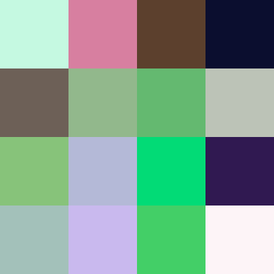

I am not a color scientist, but I know a thing or two about colour. Different wavelengths 
of radiation are percieved differently by our eyes, that's what colour is. When an
object deflects a certain wavelength of colour our eyes catch it and feel it as
purple or green. An object is white when all light is reflected, black when all of it
is absorbed. Great. Light sources work differently, they emit a specific wavelength:
computer pixels emit a combination of red, green and blue of different intensities.
So if we just emit a random amount of each we get a truly random colour!


```rs
pub fn random_colour() -> (u8, u8, u8) {
    (random::<u8>(), random::<u8>(), random::<u8>())    
}
```

This is where I would've left the article if we literally percieved the light as RGB.
As a matter of fact, we don't. There is a lot of nuance to human vision, but
I'd like to focus on aesthetic (and arguably subjective) definition
of a *good* random colour. The problems might be apparent when we look
at some sample results.



If you find that to be good enough, you are free to go. Personally, I am not satisfied. They all seem bleek, most are very dark, they are also pretty green. All of those might be issues of a specific sample, but I assure you, they are not.
