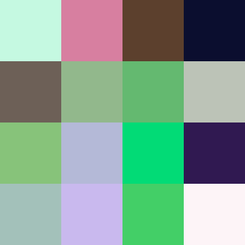

I am not a color scientist or a psychophysisist, but I know a thing or two about colour. 
The question of generating good-looking random colour has bugged me for a while now. 
Most of the time the precision of it is really unnecessary, however, I still find it
problematic. My first encounter with it was when one of my friends decided to 
shade cubes in an application based on a seed value and a builtin `random` function.
The result was underwhelming. Many times, 5 or 6 seed values later they settled
on a decent one, but this problem hurt me. 

To understand what we can do, we first need to understand the nature of what exactly we
are fixing. The colours were different wavelengths 
of radiation are percieved differently by our eyes, that's what colour is. When an
object deflects a certain wavelength of colour our eyes catch it and feel it as
purple or green. An object is white when all light is reflected, black when all of it
is absorbed. Great. Light sources work differently, they emit a specific wavelength:
computer pixels emit a combination of RGB (red, green and blue) of different intensities.
So if we just emit a random amount of each we get a truly random colour!


```rs
pub fn random_colour() -> (u8, u8, u8) {
    (random::<u8>(), random::<u8>(), random::<u8>())    
}
```

This is where I would've left the article if we literally percieved the light as RGB.
Yes, these three colours were chosen due to our eyes containing three types
of photoreceptors to differentiate colour: the cones. However, as with all things, 
there is a lot of nuance to human vision, so a *better* colour definetly
requires more effort. The problems might become apparent when if we look
at a colour sample results.



If you find that to be good enough, you are free to go. Personally, I am not satisfied.
