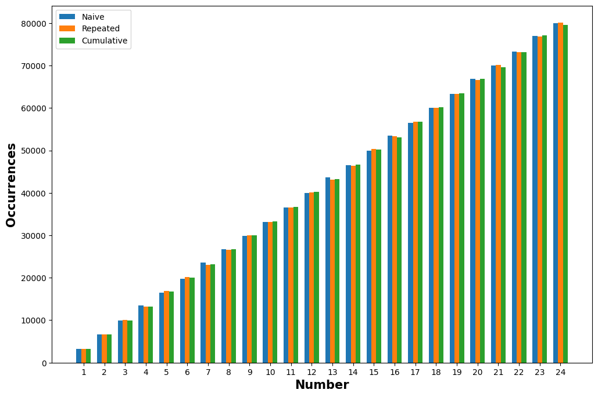

Non-trivial probabilities aren't that difficult compared to other computer science concepts, especially if you are an experienced programmer and/or probabilist. However, that doesn't mean that rookie programmers fresh out of a bootcamp have same easy time as you, the Nutella-titled codeforces enjoyer. This is a case of one of my students who shall remain undisclosed. It happened when as an exercise I suggested rewriting Python's `random` builtin module entirely from scratch. Said student had to learn about pseudo-randomness in computers and I assumed they would have a great time with it.

All was good and dandy until the deal came to implementing `random.choices`[^python-std-choices]. The function takes in a list of items, a list of weights and some integer `k` (the original definition also includes optional cumulative weights, but they can be derived from weights if/when necessary). The function itself samples (draws a random element from) the item list with replacement `k` times, such that likelyhood of each element being drawn is determined by its respective weight (the higher the weight, the higher the probability). In the end you get a list of length `k` with elements randomly chosen from the supplied list, where elements with higher weights were more likely to get picked. For clarity explore the example below.

```py
from random import choices

k = 1
chosen: list[str] = choices(['a', 'b', 'c'], [4, 8, 0], k=k)
assert len(chosen) == k

x: str = ls[0]

print(x) # P(x='a') = 4 / (4 + 8 + 0) = 1/3
         # P(x='b') = 8 / (4 + 8 + 0) = 2/3
         # P(x='c') = 0 / (4 + 8 + 0) = 0
```


You can already figure out that drawing with replacement simplifies the task to repeating calls of the "weighted draw" function `k` times, so let us focus our attention on that. We will take for granted a function `randint(a, b)` that returns a perfect uniformly distributed random number in range `[a; b)` or `[a; b[`. Also drop all error handling, since it will only clutter the code and it doesn't change the algorithm much. Based on what was said before, the `choices` function may look like this:

```py
def choices(population: list, weights: list, k: int) -> list:
    return [weighted_draw(population, weights) for _ in range(k)]
```

The most naive implementation of `weighted_draw` would look something like the following:

```py
def naive_weighted_draw(population: list, weights: list):
    weighted_population = []
    for w, p in zip(population, weights):
        weighted_population.extend(p for _ in range(w))
    return weighted_population[randint(0, len(weighted_population))]
```

This approach is very direct and clearly didn't take much effort. We can assume that the implementation is drawn from the previous experience of implementing a function that samples a random element uniformly. It... works. Not in the nearly best way, not in all cases (e.g. fractional weights), the memory usage can be through the roof in some edgecases, but it limps. Not remotely good enough for production. There is a better candidate.

```py
def random_01():
    return randint(0, 2**32) / 2**32

def repeated_sampling_weighted_draw(population: list, weights: list):
    total_w = sum(weights)
    probabilities = list(map(lambda w: w / total_w, weights))
    while True:
        for e, p in zip(population, probabilities):
            if random_01() <= p:
                return e
```

In this case we keep sampling the population elements one by one with their respective probabilities. If none of the elements matched first time we just keep sampling using the `cycle` iterator tool Despite the *exceptionally poor* theoretical runtime of *O(∞)* this implementation might seem more sensible, though it raises an interesting question: are the earlier elements in the list more likely to occur when sampling? An answer might be intuitively apparent, yet it's not the same to everyone. Spoiler: the probability doesn't gets skewed, shame. The probability for any noninitial element to occur is exactly the probability of it to occur on its own **given** that none of the previous elements were chosen. If you expand it according to Bayes' Theorem[^3b1b-bayes] we get that the probability is in fact independent, so this algorithm is nontheless sound. Anyhow, what gives? This didn't save us from *O(∞)*, so we are safe to forget this solution.

The following implementation employs cumulative weights and is most certainly the reason why this function in Python's standard library accepts them (cumulative weights) in the first place. For those unfamiliar with the concept, they are a prefix sum of the weights by definition, so some weight + all the weights preceding it. The cumulative weights are monotonously increasing which makes them a perfect subject for bisection (and binary search, respectively). Now we pick a random number from 0 to the maximum cumulative weight and search for its respective population element using the cumulative weights, bingo! Will all knowledge gathered, final implementation is as follows:

```py
from itertools import accumulate
from bisect import bisect

def choices(population: list, weights: list, k: int) -> list:
    return [weighted_draw(population, weights) for _ in range(k)]

def cumulative_weighted_draw(population: list, weights: list):
    cum_weights = accumulate(weights)
    max_cum_weight = cum_weights[-1]
    index = bisect(cum_weights, random_01() * cum_weights[-1])
    return population[index]
```

Funnily enough, this is the exact solution CPython went with [^cpython-impl], that makes me happy. Of course this implementation can be unfolded without using any of the standard functions. The overall runtime is *O(k logN)*, which is rather good: *k* for each choice and *logN* for bisecting a list of *N* elements. If you don't trust the handwavy maths consider the following chart, for which the source code can be found [here (Jupyter Notebook)](./simulate.ipynb). The functions were ran 1M times, with numbers 0 to 24 each having the weight of itself, so the larger numbers are more likely to occur. As expected, the correlation coefficient is almost 1 with 0 never appearing due to it's weight being, well, 0.



[^3b1b-bayes]: [Here](https://www.youtube.com/watch?v=HZGCoVF3YvM) is wonderful explanation of the Bayes' Theorem by 3b1b.
[^python-std-choices]: [`random.choices`](https://docs.python.org/3/library/random.html#random.choices) in Python's official documentation.
[^cpython-impl]: [Link](https://github.com/python/cpython/blob/46957091433bfa097d7ea19b177bf42a52412f2d/Lib/random.py#L454-L489) to CPython's implementation of `random.choices` as of writing this post.